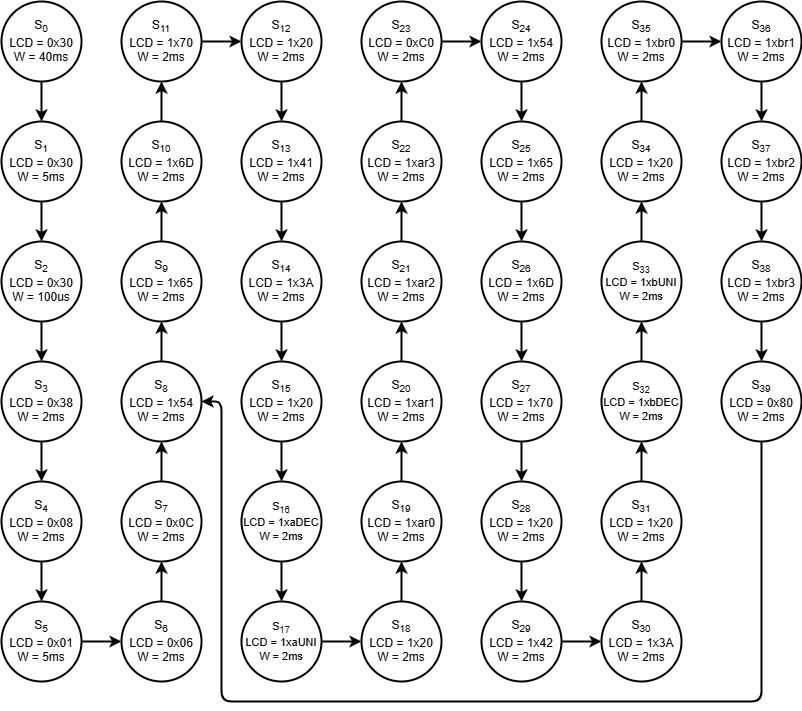
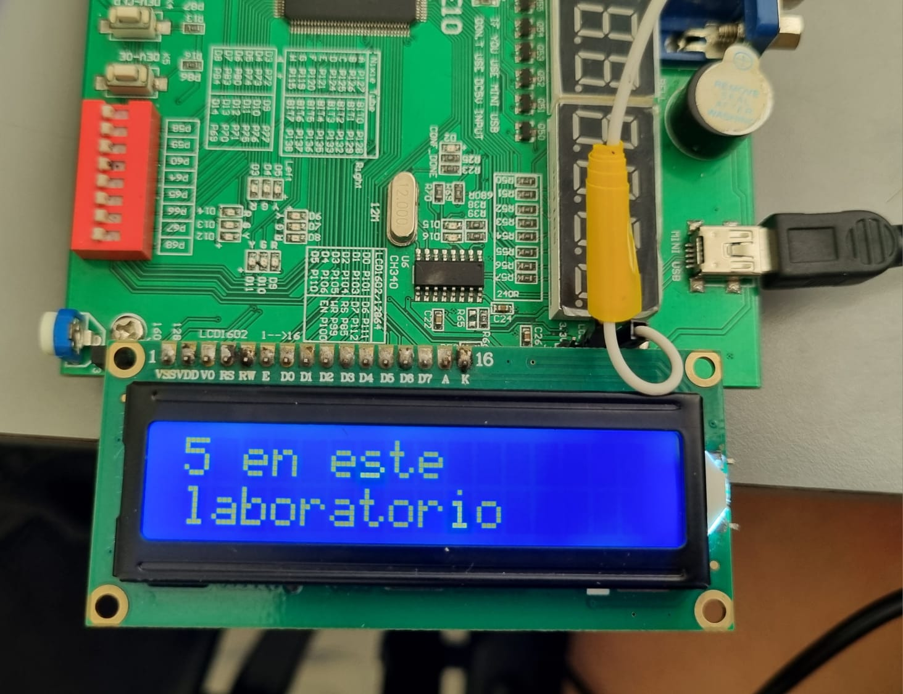

# Informe de Laboratorio 04: Visualización usando pantalla LCD 16x2 en modo paralelo

## Integrantes

**Juliana Zúñiga Cruz - 1032800049** \
**Karen Gissell Buitrago Osorio - 1077112461** \
**Nicolas Ramírez Gonzalez -  1023371323**

Indice:

1. [Diseño implementado](#diseño-implementado)
2. [Simulaciones](#simulaciones)
3. [Implementación](#implementación)
4. [Conclusiones](#conclusiones)
5. [Referencias](#referencias)

## 1. Descripción
Este laboratorio consistió en el diseño, simulación e implementación en hardware de un sistema de visualización alfanumérica utilizando una pantalla LCD 16x2 controlada mediante una Máquina de Estados Finitos (FSM) implementada en Verilog sobre una FPGA Intel/Altera Cyclone IV. 

El proyecto se dividió en dos fases principales:
1. **Fase Estática:** Análisis e implementación de la arquitectura base provista para mostrar un mensaje fijo en las dos filas de la pantalla operando en modo de 4 bits.
2. **Fase Dinámica:** Modificación del camino de datos y de la FSM para integrar dos entradas numéricas de 8 bits, convirtiendo dichos valores a su representación en código ASCII y posicionando el cursor de forma dinámica mediante comandos de la DDRAM para actualizar la pantalla en tiempo real.

---

## 2. Diagramas

### 2.1 Unidad de Control (FSM)
La máquina de estados desarrollada gestiona la secuencia de inicialización (configuración de modo 4 bits, encendido de display, clear, etc.) y la posterior escritura de datos. 

### 2.2 Arquitectura Completa del Sistema
El siguiente diagrama de bloques representa la organización del módulo *top*, mostrando la interconexión entre la unidad de control, los registros de datos, el divisor de frecuencia (para el reloj del *Enable* de la LCD) y el multiplexor que conmuta entre comandos y datos.

* > **Nota:** Dibuja el diagrama de bloques mostrando las entradas (`clk`, `rst`, y los dos vectores de 8 bits para los datos dinámicos) y las salidas físicas hacia la LCD (`RS`, `RW`, `E`, y el bus de datos de 4 bits `D4-D7`).

---

## 3. Simulaciones
Para validar el comportamiento temporal y lógico de la FSM antes de programar la FPGA, se ejecutó el *testbench* provisto en la carpeta `test`.

A continuación se presentan las capturas de la simulación en ModelSim/Questa:

### 3.1 Inicialización de la LCD
* 
* **Análisis:** Se observa cómo tras el flanco de *reset*, la señal `RS` se mantiene en `0` (modo comando) para enviar la secuencia de configuración. El pin `E` (Enable) genera los pulsos en flanco de bajada requeridos para que la LCD capture cada instrucción.

### 3.2 Transmisión de Datos (Estáticos y Dinámicos)
* 
* **Análisis:** Al pasar al estado de escritura, `RS` cambia a `1`. Se verifica que el dato dinámico de 8 bits sea transformado correctamente a su equivalente hexadecimal en formato ASCII para ser enviado en dos ciclos de 4 bits (nibble alto primero, luego nibble bajo).

---

## 4. Implementación

### 4.1 Configuración Física y Asignación de Pines
La implementación se realizó sobre la tarjeta **Altera Cyclone IV**. Se conectó la pantalla respetando la orientación del pin 1 del *header* de la PCB. La asignación de pines en el *Pin Planner* de Quartus Prime se realizó de acuerdo a la serigrafía de la tarjeta.

Para garantizar el correcto funcionamiento del bit de datos conectado al **pin 101**, se modificó su comportamiento predeterminado en Quartus:
1. `Assignments` -> `Device` -> `Device and Pin Options`.
2. Categoría: `Dual-Purpose Pins`.
3. Modificación del pin `nCEO` a **"Use as regular I/O"**.

### 4.2 Evidencia del Funcionamiento en Hardware
A continuación se muestran los resultados finales en la tarjeta de desarrollo:

#### 4.2.1 Mosaico de los estados de la implementación en hardware
Las imágenes están ordenadas del estado `0` al `15` y muestran las capturas tomadas durante la implementación en la FPGA.

| Estado 0 | Estado 1 | Estado 2 | Estado 3 |
|---|---|---|---|
|   Estado 0 |   Estado 1 |   Estado 2 |   Estado 3 |
| Estado 4 | Estado 5 | Estado 6 | Estado 7 |
|   Estado 4 |   Estado 5 |   Estado 6 |   Estado 7 |
| Estado 8 | Estado 9 | Estado 10 | Estado 11 |
|   Estado 8 |   Estado 9 |   Estado 10 |   Estado 11 |
| Estado 12 | Estado 13 | Estado 14 | Estado 15 |
|   Estado 12 |   Estado 13 |   Estado 14 |   Estado 15 |

#### Parte 1: Texto Estático
  
  *Descripción:* Visualización exitosa del texto base en la fila 1 y fila 2.

#### Parte 2: Texto Dinámico con Entradas de 8 bits
* 
* *Descripción:* Modificación de los interruptores/entradas de prueba para cambiar los valores de 8 bits. Se observa cómo el cursor se posiciona automáticamente al final del texto estático para actualizar la lectura numérica en tiempo real.

---

## 5. Conclusiones
* 
---

## 6. Referencias
*