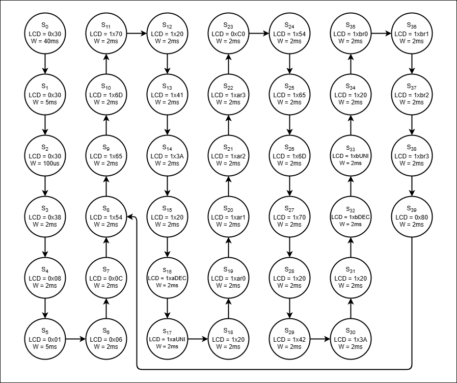
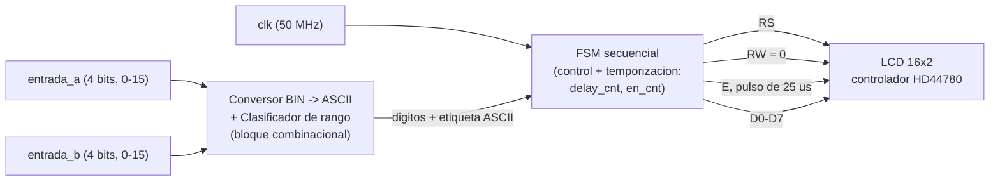
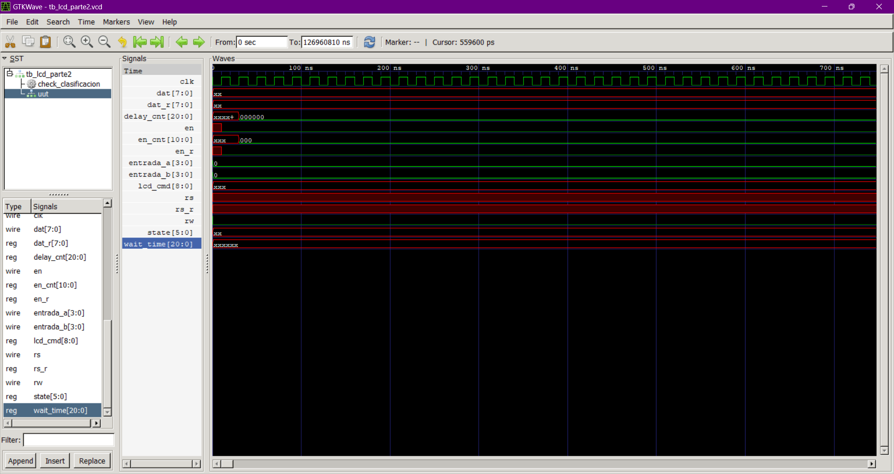

[](https://classroom.github.com/online_ide?assignment_repo_id=24121059&assignment_repo_type=AssignmentRepo)
# Informe de Laboratorio 04: Visualización usando pantalla LCD 16x2 en modo paralelo

## Integrantes

**Juliana Zúñiga Cruz - 1032800049** \
**Karen Gissell Buitrago Osorio - 1077112461** \
**Nicolas Ramírez Gonzalez -  1023371323**

Indice:

1. [Diseño implementado](#diseño-implementado)
2. [Simulaciones](#simulaciones)
3. [Implementación](#implementación)
4. [Conclusiones](#conclusiones)
5. [Referencias](#referencias)

Este laboratorio consistió en el diseño, simulación e implementación en hardware de un sistema de visualización alfanumérica sobre una pantalla LCD 16x2 (controlador HD44780), controlada mediante una Máquina de Estados Finitos (FSM) descrita en Verilog sobre una FPGA Intel/Altera Cyclone IV.

El proyecto se dividió en dos fases:

1. **Fase estática (módulo `LCD`):** secuencia de inicialización del controlador y escritura de un mensaje fijo en las dos filas de la pantalla (`"5 en este"` en la fila 1 y `"laboratorio"` en la fila 2). La FSM ejecuta la secuencia una sola vez y queda detenida en el estado final.

2. **Fase dinámica (módulo `lcd_parte2`):** se reemplaza el mensaje fijo por dos valores numéricos de entrada (`entrada_a` y `entrada_b`, cada uno de 4 bits, rango 0–15, tomados de un banco de 8 switches físicos). Cada valor se convierte a su representación decimal en ASCII y se acompaña de una etiqueta de clasificación calculada por comparación de magnitud:

   | Rango de entrada | Etiqueta mostrada |
   |---|---|
   | 0 – 4 | `BAJO` |
   | 5 – 10 | `MEDI` |
   | 11 – 15 | `ALTO` |

   La etiqueta se limita a 4 caracteres (columnas 11 a 14 de cada fila) por restricción de espacio en la pantalla; por eso el rango medio se abrevia `MEDI` en lugar de `MEDIO`. El formato final de cada fila es:

   ```
   Temp A: DD XXXX
   Temp B: DD XXXX
   ```

   donde `DD` son las decenas/unidades del valor (00–15) y `XXXX` es `BAJO`, `MEDI` o `ALTO`. A diferencia de la fase estática, esta FSM no se detiene: al terminar de escribir la fila 2 regresa al inicio de la fila 1 (comando `0x80`), generando un refresco continuo que permite que el valor mostrado siga a las entradas físicas en tiempo real.

   Un punto importante al revisar el código: la secuencia de inicialización (`0x30`, `0x30`, `0x30`, `0x38`) corresponde al protocolo estándar del HD44780 para **interfaz de 8 bits** (`0x38` = Function Set con `DL=1`), no de 4 bits. El bus de datos `dat` se maneja como un byte completo por cada carácter/comando, sin partir en nibbles. Esto se corrigió respecto a la descripción inicial del informe.

---

## 2. Diagramas

### 2.1 Unidad de Control (FSM)

La FSM gestiona la inicialización del controlador y la escritura secuencial de cada carácter. El siguiente diagrama resume la versión dinámica (`lcd_parte2`), agrupando los 40 estados individuales del código en bloques funcionales:



### 2.2 Arquitectura completa del sistema

El módulo `lcd_parte2` combina tres bloques: lógica combinacional de conversión/clasificación, la FSM secuencial de control, y la generación de temporización para las señales físicas hacia la LCD.



El bloque combinacional (`always @(*)`) calcula, para cada entrada, las cifras decimal/unidad (`/10`, `%10`, sumando `8'h30`) y la etiqueta de 4 caracteres mediante comparaciones `<= 4`, `<= 10`. Estos valores quedan disponibles permanentemente; es la FSM la que decide en qué estado tomarlos y enviarlos a la LCD, junto con el bit `RS` correspondiente (comando o dato) empaquetado en `lcd_cmd[8]`.

---

## 3. Simulaciones

Antes de programar la tarjeta, se verificó el funcionamiento del módulo lcd_parte2 mediante simulación en Verilog. El objetivo de esta verificación fue confirmar dos aspectos del diseño de manera independiente al hardware físico: la lógica combinacional que clasifica cada valor de entrada en los rangos BAJO (0–4), MEDI (5–10) y ALTO (11–15), y el protocolo de comunicación hacia la pantalla LCD a través de las señales rs, en, rw y dat.

La simulación se realizó con Icarus Verilog (iverilog para compilar, vvp para ejecutar) y los resultados se visualizaron con GTKWave a partir del archivo de formas de onda (.vcd) generado durante la ejecución.

### Testbench

Se diseñó un testbench (tb_lcd_parte2:[código test bench](codigos/tb_lcd_parte2.v)) que instancia el módulo lcd_parte2, genera un reloj de 50 MHz equivalente al de la tarjeta (periodo de 20 ns) y aplica de forma secuencial los 16 valores posibles de entrada (0 a 15) a entrada_a y entrada_b simultáneamente, replicando los mismos 16 estados documentados en la sección de evidencias fotográficas. Para cada valor, el testbench espera a que la máquina de estados de la LCD complete un refresco completo de ambas filas antes de pasar al siguiente valor, y compara automáticamente la etiqueta de rango obtenida (BAJO/MEDI/ALTO) contra el valor esperado, reportando el resultado por consola.

Dado que los tiempos reales de escritura hacia la LCD están en el orden de milisegundos (la inicialización sola toma 40 ms, y cada carácter requiere 2 ms adicionales), una simulación con los tiempos originales del módulo implica recorrer decenas de millones de ciclos de reloj, lo cual resulta poco práctico para verificación rápida. Por esta razón se generó una segunda versión del módulo (LCD_parte2_sim.v) idéntica en toda su lógica, pero con los parámetros de tiempo (DELAY_40MS, DELAY_5MS, DELAY_100US, DELAY_2MS, EN_HIGH_T) reducidos únicamente para fines de simulación. Esta versión no se utilizó en ningún momento para la síntesis en la FPGA; el archivo programado en la tarjeta corresponde siempre al módulo original con los tiempos reales.



Para los 16 valores evaluados, la etiqueta de clasificación generada por el módulo coincidió en todos los casos con el valor esperado, tanto en el canal A como en el canal B, sin registrarse ningún resultado fallido en la consola de simulación. Esto valida que la lógica combinacional de clasificación BAJO/MEDI/ALTO funciona correctamente para todo el rango de valores representable con las 4 entradas de cada canal (DIP switches).


## 4. Implementación

### 4.1 Configuración Física y Asignación de Pines
La implementación se realizó sobre la tarjeta **Altera Cyclone IV**. Se conectaron las 8 líneas de datos (`D0`–`D7`) además de `RS`, `RW` y `E`, ya que, como se mostró en la sección 1, el `Function Set 0x38` configura el controlador HD44780 en **interfaz de 8 bits**. La pantalla se conectó respetando la orientación del pin 1 del *header* de la PCB, y la asignación de pines en el *Pin Planner* de Quartus Prime se realizó según la serigrafía de la tarjeta.

Para garantizar el correcto funcionamiento del bit de datos conectado al **pin 101**, se modificó su comportamiento predeterminado en Quartus:
1. `Assignments` → `Device` → `Device and Pin Options`.
2. Categoría: `Dual-Purpose Pins`.
3. Modificación del pin `nCEO` a **"Use as regular I/O"**.

### 4.2 Evidencia del Funcionamiento en Hardware
A continuación se muestran los resultados finales en la tarjeta de desarrollo:

#### Parte 1: Texto Estático
 

*Descripción:* visualización exitosa del texto fijo `"5 en este"` (fila 1) y `"laboratorio"` (fila 2), generado por el módulo `LCD`.


#### Parte 2: Texto Dinámico con Entradas de 8 bits

Las imágenes están ordenadas del estado `0` al `15` (valor mostrado en ambos canales) y muestran capturas tomadas durante la implementación en la FPGA, generadas por el módulo `lcd_parte2`. En cada una se observa el valor decimal junto a su etiqueta de clasificación (`BAJO`/`MEDI`/`ALTO`).

|  |  |  |  |
|---|---|---|---|
| <br>**Estado 0** | <br>**Estado 1** | <br>**Estado 2** | <br>**Estado 3** |
| <br>**Estado 4** | <br>**Estado 5** | <br>**Estado 6** | <br>**Estado 7** |
| <br>**Estado 8** | <br>**Estado 9** | <br>**Estado 10** | <br>**Estado 11** |
| <br>**Estado 12** | <br>**Estado 13** | <br>**Estado 14** | <br>**Estado 15** |


Se verifica que para los 16 valores posibles de cada entrada (0–15) la etiqueta de clasificación corresponde a lo definido en la lógica combinacional de la sección 1: estados 0–4 muestran `BAJO`, estados 5–10 muestran `MEDI` y estados 11–15 muestran `ALTO`.

---

## 5. Conclusiones

* La separación entre lógica combinacional (conversión BIN→ASCII y clasificación de rango) y lógica secuencial (FSM de control) facilitó la depuración: los cambios en el formato del mensaje no requirieron tocar la temporización, y viceversa.
* El mecanismo de `busy`/`delay_cnt`/`wait_time` permitió generalizar la espera entre comandos sin necesidad de estados separados para cada tiempo distinto del datasheet (40 ms, 5 ms, 100 µs, 2 ms), reduciendo la cantidad de código repetido.
* Confirmar la interfaz real (8 bits, según el comando `0x38`) frente a lo asumido inicialmente (4 bits) fue clave: una FSM de inicialización incorrecta para el modo de la LCD habría impedido cualquier comunicación válida con el controlador HD44780.
* El diseño de refresco continuo en la fase dinámica (sin un estado de "espera de cambio") simplifica el control a costa de un pequeño retardo de actualización (~64 ms por ciclo completo), que en la práctica es imperceptible para un usuario.
* La implementación en hardware sobre los 16 valores posibles (0–15) para ambos canales confirmó que la conversión a ASCII y la clasificación por rango funcionan de forma consistente con lo simulado.

---

## 6. Referencias

* Hitachi. *HD44780U (LCD-II) Dot Matrix Liquid Crystal Display Controller/Driver* — datasheet del controlador utilizado por la pantalla LCD 16x2.
* Intel/Altera. *Cyclone IV Device Handbook* — documentación de la FPGA utilizada para la implementación.
* Intel. *Quartus Prime Pin Planner User Guide* — referencia para la asignación de pines y configuración de pines de propósito dual.
* IEEE Std 1364. *IEEE Standard for Verilog Hardware Description Language*.
*
